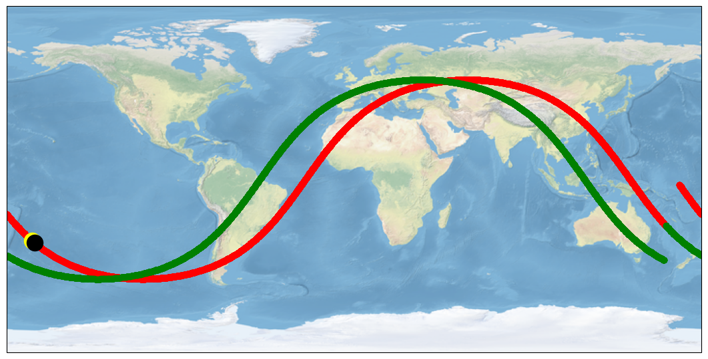

# satTrack-api

API for satellite tracking data.
This project uses anaconda for python environment.

## Getting Started

1. Create environment using: conda env create -f environment.yml --name venv
2. Start the virtual env using: conda activate venv
4. Run the program with flask run in venv.

### Prerequisites

* Python3
* Anaconda (Miniconda)

## Deployment

Deploy to your server to access the API. 

## Built With

* Python3
* Flask

## Authors

* **Chinmay Sharma**

## License

This project is licensed under the MIT License.